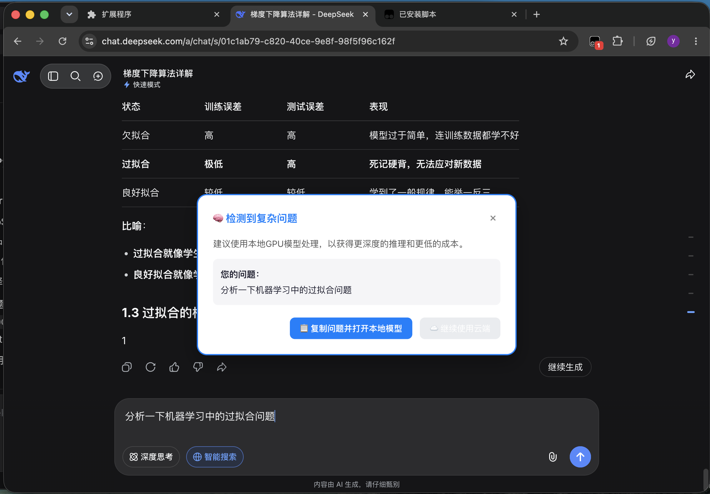

# AI请求分类机器人 🤖

## 一句话介绍
> 一个浏览器油猴脚本 + 本地Python服务，自动判断你在AI对话中输入的问题复杂度，当检测到复杂问题时会弹窗建议你使用本地GPU处理，帮你节省云端API费用并获得更深度的推理。

## 功能演示

## 工作原理
1. 你在DeepSeek（或其他支持的AI聊天页面）输入问题
2. 油猴脚本捕获输入内容，发送到本地Python后端
3. 后端基于规则（关键词+长度）计算复杂度分数
4. 若判定为复杂（`is_complex: true`），弹出一个模态框：
   - 显示你的问题
   - 提供“复制问题并打开本地模型”按钮
   - 允许“继续使用云端”
5. 你可以一键将复杂问题转移到本地运行的LLM（如Ollama、LM Studio）中处理

## 如何安装使用

### 前提条件
- 安装了 [Tampermonkey](https://www.tampermonkey.net/) 浏览器扩展
- Python 3.7+ 环境

### 步骤
1. **下载脚本**：从本仓库获取 `ai_router.user.js` 和 `backend.py`
2. **安装依赖**：`pip install flask flask_cors`
3. **启动后端**：`python backend.py`（保持终端运行）
4. **安装油猴脚本**：在Tampermonkey中新建脚本，粘贴 `ai_router.user.js` 内容并保存
5. 访问 [DeepSeek Chat](https://chat.deepseek.com)，输入一个复杂问题（如“解释机器学习中的过拟合”）
6. 你会看到一个弹窗，按提示操作即可

### 自定义配置
- 修改后端 `backend.py` 中的 `complex_indicators` 列表和阈值 `score >= 2`
- 修改油猴脚本中的 `LOCAL_MODEL_URL` 为你本地模型服务的地址（例如Ollama默认 `http://localhost:11434`）

## 项目结构